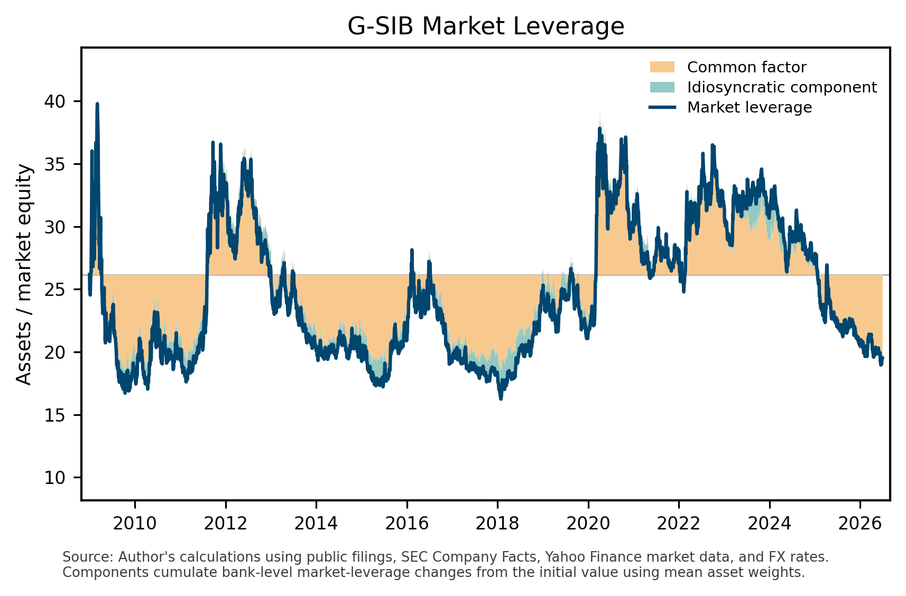

# G-SIB Market Leverage

This repository publishes a reproducible public-data measure of market leverage for listed global systemically important banks (G-SIBs). The series tracks global banks' market-valued leverage and its common and idiosyncratic components.

The project complements research based on book leverage. Book leverage remains the more direct measure of bank balance-sheet capacity, but market leverage can be observed at higher frequency and reflects changes in market equity values.



## Outputs

- `data/gsib_market_leverage.csv`: daily market leverage and cumulative decomposition components.
- `chart/gsib_market_leverage_decomposition.png`: one-chart summary of market leverage, the common PCA component, and the idiosyncratic component.

## Method

For each listed G-SIB, market leverage is computed as

```text
market leverage = (book debt + market equity) / market equity
```

where book debt is total assets minus book equity, and market equity is share price times shares outstanding. Non-USD balance-sheet and market-equity components are converted to USD before aggregation.

The aggregate market-leverage series is a mean-share-weighted average:

```text
L_t = sum_i sbar_i L_{i,t}
```

where `sbar_i` is bank `i`'s average share of public G-SIB market-valued assets over the estimation sample.

Bank-level market-leverage changes are split into a common PCA component and an idiosyncratic residual component. These components are aggregated with mean market-asset shares and cumulated from the initial aggregate leverage value, so initial leverage plus the two cumulative components reconstructs the plotted market-leverage series.

## Data Sources

The project uses only public sources:

- SEC Company Facts API for SEC-reporting G-SIBs.
- Links to annual, interim, and quarterly reports for non-SEC or historically missing observations.
- Yahoo Finance via `yfinance` for listed equity prices, shares outstanding, and FX rates.

Raw financial-statement PDFs are not included in this repository. Older filing links are documented in `source_data/financial_statement_links.csv`, and the numerical balance-sheet panel is in `source_data/official_balance_sheets.csv`.

## Automation

The GitHub Action runs monthly. It refreshes SEC Company Facts observations, rebuilds the market-leverage series, regenerates the chart, and commits updated public outputs.


